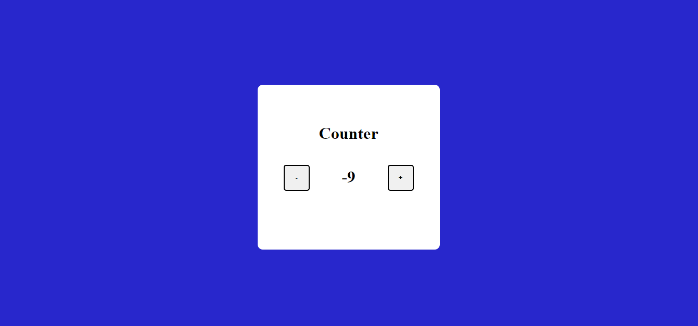
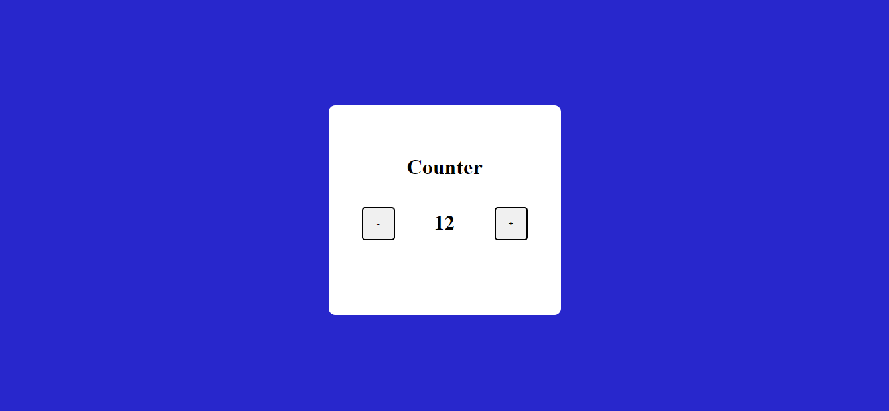

# PRANAV MATHUR

## Learnings from the project:

- Adding JS methods like _onclick_ as HTML attributes
- Separating code into different functions so it becomes more readable

## Time taken:

    It took me 20 minutes to complete this project.

## Screenshots:

## Live link:

[Go to site](https://05-basic-counter.netlify.app/)
